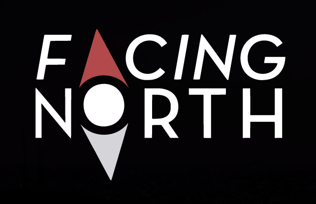

# Interactive Web Documentaries

Interactive web documentaries are intended  to be viewed and experienced in a browser environment, typically involving some mix of interaction and audio-visual feedback. Interactive developers must handle a wide array of technological innovations and fallbacks to reach a wide audience. Additionally, there is no de-facto standard, book, blog, or framework on how to code or implement interactive media. Due to these facts, organizing and coding these types of projects is a blank canvas. Are you ready to start painting?

**Look deeper into Facing North by checking out:**

- Facing North at http://areyoufacingnorth.com
- Matt's talk on building it, at: http://matthiasak.github.io/Presentation-AreYouFacingNorth/
- Further demo on Facing North's layout: http://codepen.io/matthiasak/full/ptHbw

**To really have a strong grasp on what JavaScript framework to use, or how to build your own, check out:**

- DailyJS series on "DIY jQuery": http://dailyjs.com/framework.html
- Learn about JavaScript prototypes and MVC patterns: http://addyosmani.com/resources/essentialjsdesignpatterns/book/
- Read (and try to interpret) the jQuery source code: http://robflaherty.github.io/jquery-annotated-source/
- Read (and try to interpret) the Backbone source code: http://backbonejs.org/docs/backbone.html

It takes a lot of extra reading and work to cover these items, but a few hours of deliberate practice, a notepad, and some great notes can you really boost your skills.

**See more examples of interactive web documentaries with this list of Matt's latest favorites:**

- Clouds Over Cuba - an interactive and historic documentary on the Cuban Missile Crisis: http://cloudsovercuba.com/
- Pharrell's "24 Hours of Happy" - an interactive music video with a circular UI: http://24hoursofhappy.com/
- Hollow - an interactive web documentary and multimedia collage with an immersive and inspiring combination of imagery, data-driven documents, videos, and sounds centered around a McDowell County in West Virginia: http://hollowdocumentary.com/
- This Place - a web documentary with accompanying images and posts about the Oregon coastline: http://thisplacejournal.com/