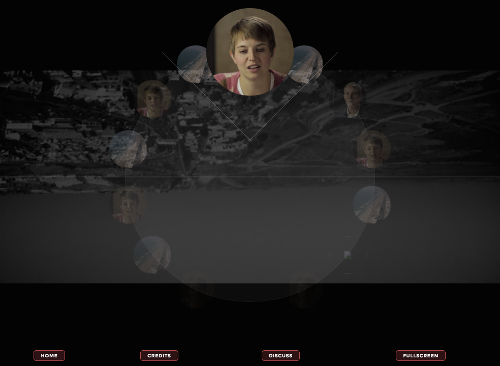
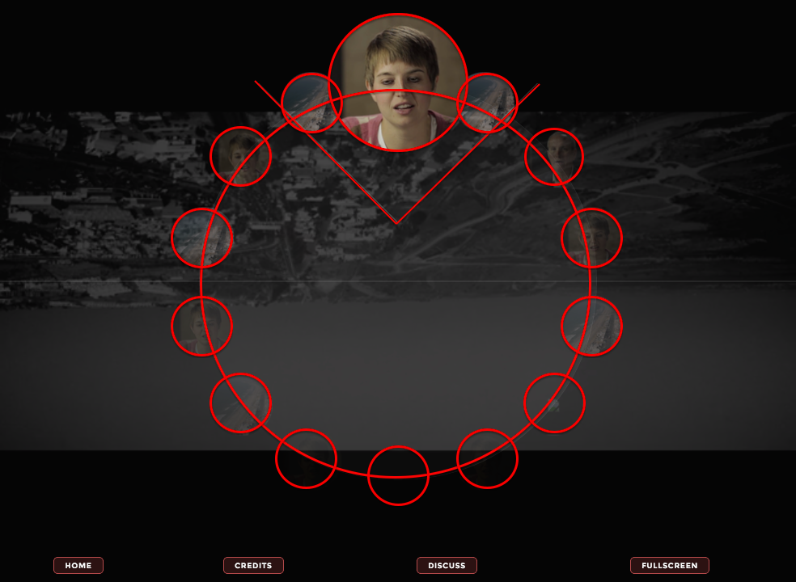
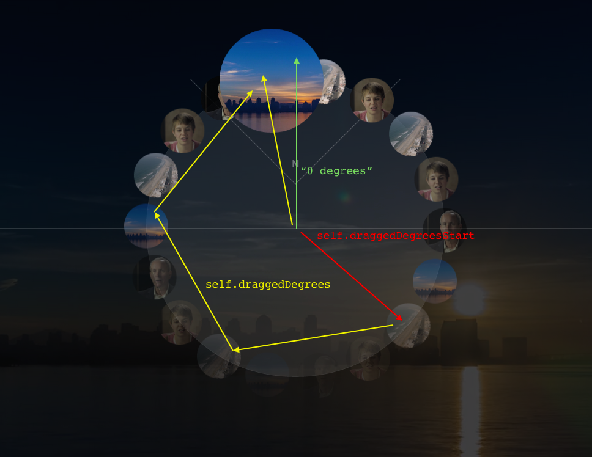

Custom user interface controls are notoriously difficult and inconsistent on multiple devices. When your design team has edgy and delightful design ideas – yet you don't know where to start – you may need to resort to "outside the box approaches."

This is better said than done, as custom UI patterns can be difficult to implement. Thus, executing on the design requires pretty intimate knowledge of:

- layout and positioning with CSS,
- browser support,
- and a strong grasp of JavaScript.

Wrapping all this up in an edgy user interface can be tiresome, tedious, and taxing.

There are three primary goals of this article:

1. Demonstrate a UI approach for an interactive web documentary,
2. Establish a "DIY" code ethic for this UI, and
3. Demonstrate how JS, CSS, and HTML can be combined to expressively create original interfaces

The context of this article is an original interface developed for an "interactive web documentary" called Facing North ([http://areyoufacingnorth.com](http://areyoufacingnorth.com)). The main interaction of Facing North involves a rotating menu, which fades in when the screen is touched or the mouse is moved during video playback, and fades out again after a few seconds.

Facing North consists of 18 separate videos, which are viewable by dragging the compass in either direction via mouse or touch. The compass will track with the cursor or finger, letting the user select a video to play.

### The Approach: HTML and CSS



As mentioned earlier, the building blocks of custom UI controls involves intimate knowledge of CSS layout and positioning. Capitalizing on layout, animations, and pseudo-classes produces effective, responsive UIs.

Here is the HTML for this small, contrived example of the Facing North compass menu:

	<div class="container">
	    <div class="compass">
   	      	<!--
   	      		18 of these will be created by JavaScript:
		        
	        -->
	        <div class="north-indicator"></div>
	    </div>
	</div>



1. The `.container` element adds the transparent black overlay and can be sized with `vh` and `vw` units to to make it a fullscreen overlay. Make sure to handle an issue with Safari on iOS, which currently has some support issues, so it's best to recalculate the CSS with JavaScript `onresize` or use `%` widths.
2. The design includes a horizontal "range" across the middle screen, which can be accomplished with a CSS pseudo-element.
3. The `.compass` element is highlighted by a white, circular border. The `.compass` must be small enough to fit on the screen, it must sit absolutely-centered on the `.container` (vertically and horizontally centered), and it must be perfectly circular. Maintaining a square box-model is attained by using an `::after` pseudo-element that has `padding-top:100%`. More on this on the Github repo.
4. The `.orbiter` elements, which are simply `` tags that "orbit" around the compass. These will be created in our JavaScript to show how we can handle evenly distributing *any* number of orbiters around the compass, not just 18. This will involve some math.
5. The `.north-indicator` element, which sits positioned at the top center of the compass, denoting north on the compass and the selected video.

You can read more about the CSS on the Github repo.


The primary problem in the UI is the transforms applied to each `.orbiter` element. This is handled in the JavaScript.

### The Glue: JavaScript

There a few major components of the JavaScript for Facing North's compass UI:

- A prototype (JavaScript "class") to handle logic for the entire compass UI
- A prototype (JavaScript "class") to handle logic for each Orbiter
- Polyfills (to help support older browsers - e.g. `requestAnimationFrame()`, `addEventListener()`)

The JavaScript initializes `onload` with:

	window.onload = app;
	function app() {
	    rAFPolyfill();
	    window.vendorPrefix = getVendorPrefix();
	    var compass = new Compass(18, document.querySelector('.compass'));
	}

In `app()`, there is a polyfill added for `requestAnimationFrame()`, we create a new instance of the `Compass` "class", and `getVendorPrefix()` is called to retrieve CSS prefixes of the browser – e.g. `-webkit-`, `-ms-`, or `-moz-`.

The rest of the JavaScript is run through the constructor `new Compass()`, which takes `num`  Orbiters to create and distribute around the compass UI, and a reference to the compass UI DOM element. The Compass constructor is quite simple:

```
function Compass(num, compassElement) {
    this.rotation = 0;
    this.orbiters = this.addOrbiters(num, compassElement);
    this.compassElement = compassElement;
    this.rotate();
    this.handleInteractionEvents();
}
```

Most of the animation and interaction is handled by `handleInteractionEvents()`, `addOrbiters()` just creates `num` `Orbiter()` objects and stores them in an array:

```
Compass.prototype.addOrbiters = function(num, compass) {
    var i = num,
        orbiters = [];

    while (typeof i === "number" && i--) {
        orbiters.push(new Orbiter(compass, i));
    }

    return orbiters;
}
```

The `Orbiter()` constructor in the live version pulls JSON data from a server; the following is just a contrived example created for this article, which, creates `` tags with JavaScript:

```
function Orbiter(compass, index) {
    var img = document.createElement('img');
    img.className = "orbiter";
    img.src = "./images/screen" + (index % 4 + 1) + ".png";
    this.img = img;
    compass.appendChild(img);
}
```

There is one function that is used to animate the position of each `Orbiter()` during interaction, and that is `Compass.rotate()`:

```
Compass.prototype.rotate = function(delta) {
    var self = this;
    for (var i = 0, len = self.orbiters.length; i < len; i++) {
        self.orbiters[i].setTransform(i, self.compassElement.offsetWidth, delta || 0, ~~(360 / self.orbiters.length));
    }
}
```

`Orbiter.rotate()` has a few things worth nothing here:

1. `i` - The spot in place (i.e. could be an integer between 0 to 17 if there are 18 `Orbiter()` objects to be distributed around the compass)
2. `self.compassElement.offsetWidth` - The diameter of the compass, in pixels
3. `delta || 0` - the current rotation (in degrees, between 0 and 359) to set each `Orbiter()` (`Orbiters()` with an `i` greater than 0 will be rotated around an additional amount to distribute them evenly around the circumference of the compass UI)
4. `~~(360 / self.orbiters.length)` - The degrees by-which to spread out each `Orbiter()`; for example, for 18 Orbiters, each Orbiter will occupy a "slice" of the compass UI (360/18 or 20°). The '~~' is a shortcut that rounds a decimal number to the nearest integer.

The `Orbiter.setTransform()` code can be found online at the Github repo.

The rest of the `Compass()` constructor involves initializing touch and mouse event handlers:

```
Compass.prototype.handleInteractionEvents = function() {
    var self = this;

    function onTouchAndMouseStart(e) { ... }
    function onTouchAndMouseEnd(e) { ... }
    function handleDrag(e) { ... }

    $.on('mousedown touchstart', onTouchAndMouseStart, this.compassElement);
    $.on('mouseup touchend', onTouchAndMouseEnd, window);
}
```

Notice the three functions for handling touch and mouse events:

1. `onTouchAndMouseStart()` - triggered on `mousedown` / `touchstart` when the interaction with the compass UI starts.
2. `onTouchAndMouseEnd()` - triggered on `mouseup` / `touchend` when interaction has stopped and stops animating the compass UI.
3. `handleDrag()` - triggered on `mousemove` / `touchmove` when the compass UI is 'dragged' and animates the compass UI to 'track' with the user's mouse or finger.

The code for these handlers, `onTouchAndMouseStart()`, `handleDrag()`, and `onTouchAndMouseEnd()` can be found online at the Github repo.



### Final thoughts:

Through some strategic approaches, we managed to create a reusable interface pattern that reaps the benefits of the following:

- **Context-aware design**

    The design isn't just responsive (works for multiple screens and devices), it is context-aware, and I was able to add more tests to the production code for browser support, add performance and feature enhancements, and for different events and platform-specific interactions (such as the Fullscreen API and handling tab-focus events).

- **DIY code-ethic / “framework free” approach**

    Without researching, exploring, and prototyping the 'hard parts' (read: the Math and UI approaches), I would not have been able to make this work as smoothly as I did. From my experience, there was no 'wheel' to reinvent for this UI pattern, so I had to create my own.

- **Buttery smooth “do-it-and-get-out-of-the-way” animations**

    Only just enough animation is done via setting inline-styles with JavaScript; the rest are triggered via CSS transitions, `:hover` and `:active` states, and class toggling with JavaScript. Either way, doing as much animation as possible via CSS (read: declarative animations) helps the browser optimize rendering.

- **Event handler performance (touch events / mouse events vs. pointer events)**

    There wasn't much extra code to handle two separate event types (mouse and touch). I could have handled pointer events and added a polyfill for unsupported browsers, but I have noticed some performance degradation with this approach.

- **Bind low in the DOM, unbind ASAP**

    The 'drag' events were handled only when the 'start' events took place, which helps optimize memory and CPU resources whenever the compass isn't being dragged. Additionally, the 'drag' events are unbound as soon as the mouse or screen is 'released' to free up resources quickly.

- **Mathematics involved**

    The math was both the most difficult and most rewarding piece of the UI. There was some considerable opportunity cost on this prototype, and thus we needed to make the investment count and capitalize on this as part of the primary feature of the UI.
